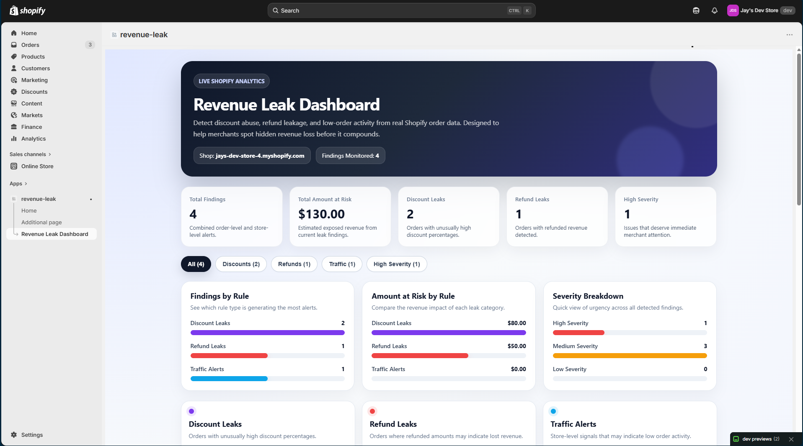
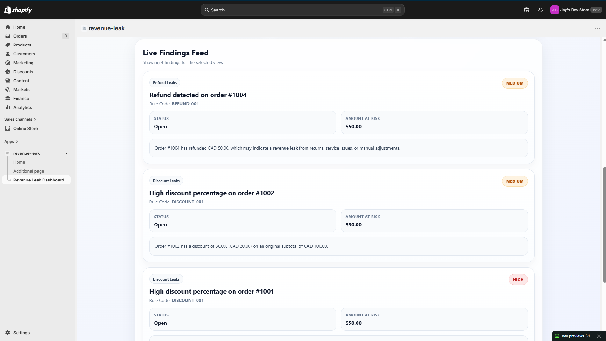

  

# 🛍️ Shopify Revenue Leak Detection System

A Shopify analytics app that detects hidden revenue loss using real order data.

🚀 Built to help merchants identify where they are losing money — from high discounts to refunds and low order activity.

---

## 🔗 Live Project
👉 Portfolio Case Study:  
https://dc61g20ci9ox4.cloudfront.net/revenue-leak.html

---

## 💡 Problem

Shopify store owners often lose revenue without realizing it due to:
- Excessive discounting
- Frequent refunds
- Low order volume despite store activity

Most dashboards show **what happened**, but not **where money is leaking**.

---

## 🧠 Solution

This app analyzes real Shopify order data and flags potential **revenue leaks** using rule-based detection.

It acts like a **financial monitoring system for Shopify stores**.

---

## 🔥 Key Features (MVP)

### 1. 💸 High Discount Detection
- Identifies orders with unusually high discount percentages
- Severity levels:
  - Medium: ≥ 30%
  - High: ≥ 50%

---

### 2. 🔁 Refund Detection
- Detects refunded orders and calculates revenue impact
- Severity based on refund amount:
  - Medium: ≥ $50
  - High: ≥ $100

---

### 3. 📉 Low Order Volume Alert (Traffic Signal)
- Flags potential store-level issues when order activity is low
- Helps identify:
  - Low traffic
  - Poor conversion
  - Store downtime issues

---

### 4. 📊 Analytics Dashboard
- Total findings overview
- Total revenue at risk
- Severity breakdown (High / Medium / Low)
- Visual charts:
  - Findings by type
  - Amount at risk by category
  - Severity distribution

---

### 5. 🎯 Smart Filtering
- Filter by:
  - All findings
  - Discount leaks
  - Refund leaks
  - Traffic alerts
  - High severity issues

---

## 🏗️ Tech Stack

**Frontend**
- React (Remix / React Router)
- Custom UI (no external chart library for MVP)

**Backend**
- Node.js
- Shopify Admin GraphQL API

**Data Layer**
- Prisma ORM

**Cloud & Hosting**
- AWS (S3 + CloudFront) — Portfolio hosting

---

## ⚙️ How It Works

1. Authenticates Shopify admin session
2. Fetches recent orders using GraphQL
3. Applies rule-based detection:
   - Discount analysis
   - Refund analysis
   - Store-level signals
4. Generates structured findings
5. Displays insights in a dashboard UI

---

## 🧪 Current Status

🚧 MVP (Minimum Viable Product)

- ✔️ Real Shopify data integration  
- ✔️ Core detection rules implemented  
- ✔️ Dashboard UI with analytics  
- ⏳ More advanced rules coming next  

---

## 🚀 Planned Features

- Abandoned checkout detection
- Chargeback monitoring
- Inventory / out-of-stock alerts
- Shipping cost vs revenue mismatch
- App subscription cost analysis
- Real-time alerts / notifications

---

## 📸 Screenshots

### Dashboard Overview

### Findings List

---

## 👨‍💻 Author

**Jayveersinh Vihol**

- 💼 Application Support Engineer (5+ years)
- 🧠 Building SaaS-style analytics tools
- 🥇 Ranked #1 in CSAT & productivity (70+ advisors)

---

## 📬 Connect With Me

- LinkedIn: https://linkedin.com/in/jayveersinh-vihol-4855a31b7
- GitHub: https://github.com/Vjayveersinh

---

## ⭐ Why This Project Matters

This project demonstrates:
- Real-world Shopify API integration
- Backend + frontend system design
- Data-driven problem solving
- Product thinking (not just coding)

---

## ⚠️ Disclaimer

This is an independent project built for learning and portfolio purposes.  
Not affiliated with Shopify.

---
